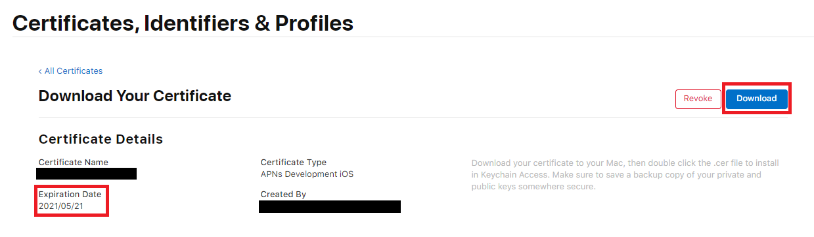

fcm-swift Firebase 연동 순서
---

### Firebase 등록

1. 프로젝트 생성  
  
2. https://firebase.google.com 접속  
  
3. 시작하기 클릭  

  
4. 프로젝트 추가  

  
5. iOS 선택  

  
6. Firebase에서 제시하는 대로 진행  
참고) Podfile 입력 시  
pod 'Firebase/Messaging'  
이것도 추가로 입력해야 함  
  
7. https://developer.apple.com/account/resources/ 접속  
  
  <br>

### 인증하기

<br>

#### 1\. APN 인증키(.p8)로 등록

1. Key 추가 (Key는 최대 2개까지만 등록 가능하므로 2개가 이미 등록되어있는 경우 APN 인증서를 등록해야 함)  

  
2. Apple Push Notifications service (APNs) 체크 후 Continue 버튼 클릭  

  
3. Register 버튼 클릭  

  
4. AuthKey_blabla.p8 파일 다운로드 받은 후 Done 버튼 클릭(파일 보관하고 있기, Key ID 기억해두기)  

  
5. Identifiers 추가  

  
6. App IDs 선택 후 Continue 버튼 클릭  

  
7. Bundle ID 입력하고 스크롤해서 Push Notifications에 체크 후 Continue 버튼 클릭 후 Register 버튼 클릭  


  
8. Firebase 콘솔로 돌아가서 iOS 설정 버튼 클릭  

  
9. 설정 > 클라우드 메시징 > iOS 앱 구성 에서 APN 인증키 업로드 버튼 클릭  

  
10.  인증키, 키 ID, 팀 ID 입력  
인증키 : 11번에서 다운로드 받았던 .p8 파일 업로드  
키 ID : 11번에서 기억해두었던 키값  
팀 ID : ? 버튼 클릭 후 조회 가능  


<br>

#### 2\. APN 인증서(.p12)로 등록

1. Configure 버튼 클릭

  
2. 개발 또는 배포용 선택

  
3. 맥에서 키체인 접근 실행 후 키체인 접근 > 인증서 지원 > 인증 기관에서 인증서 요청... 선택

  
4. 사용자 이메일 주소 및 일반 이름(프로젝트마다 다르게 하는것이 좋음) 작성 후 디스크에 저장됨을 선택한 후 계속 버튼 클릭

  
5. 4번에서 저장한 파일 업로드

  
6. 만료일 정보 잘 확인하고 Download 선택(만료일 지나면 다시 등록해줘야 함)

  
7. 다운로드된 파일을 더블클릭하여 설치하고, 키체인을 다시 열고 등록된 인증서를 찾음

  
8.  인증서를 우클릭 하고 내보내기 선택

  
9. 암호설정하고 다음 클릭(Firebase에 함께기입하기 때문에 잊지 말것)

  
10. Firebase에서 APN 인증서에 .p12 파일 등록(개발, 프로덕션 구분하여 기입)


<br>

### XCODE 설정
  
1. Xcode로 돌아와서 프로젝트 > Signing & Capabilities > + Capability > Notification 선택  

  
2. 같은 방법으로  Background Modes 추가 및 Remote notifications에 체크  

  
3. Fire > New > Target... > Notification Service Extension > 생성 > Activate    


  
4. 생성된 NotifictionService 폴더 내의 Info.plist에 다음과 같이 추가  

  
5. 소스코드 추가    
  
6. Postman으로 전송 테스트 해보기  

POST  

```
url : https://fcm.googleapis.com/fcm/send  
header  
ㄴ Content-Type: application/json  
ㄴ Authorization: key=서버키   
```


<br>

Body

```
{
    "to": "토큰 혹은 토픽",
    "content_available": true,
    "mutable_content": true,
    "priority": "high",
    "data": {
        "title": "ttt",
        "msg": "mmm",
        "imgUrl": "이미지 경로"
    },
    "notification": {
        "title": "ttt",
        "body": "mmm",
        "sound": "default",
        "badge": "1"
    }
}
```

